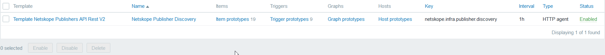
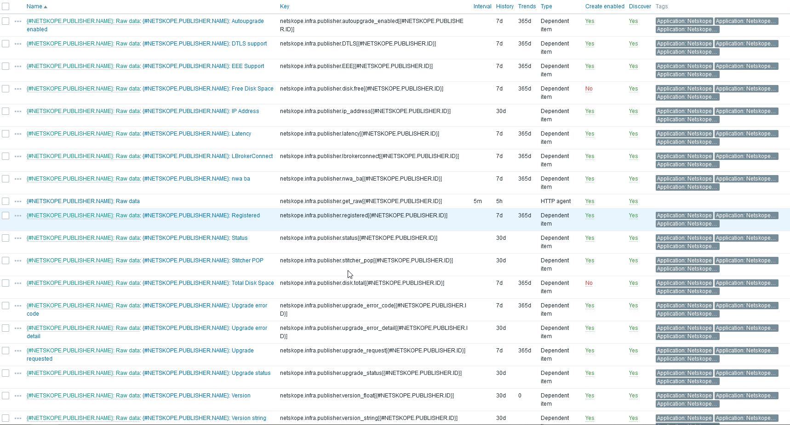
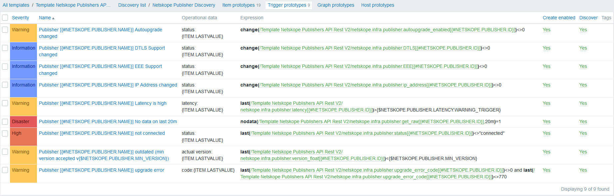
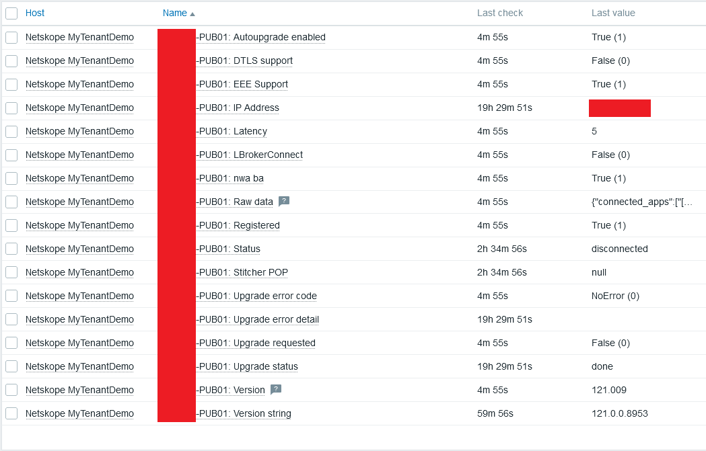

# Netskope Publisher Monitoring for Zabbix

This repository provides Zabbix templates and a Python script to monitor **Netskope Publishers** efficiently, avoiding excessive API usage and preventing HTTP 429 (Too Many Requests) errors.

---

## 🧩 Templates Overview

### Template Netskope Publishers by HTTPS.yaml

This file contains three templates:

- **Template Netskope Publishers by HTTPS SingleHost**  
  Ideal for tenants with many publishers. Makes only **one API call** and processes all publishers as a single host.

- **Template Netskope Publishers by HTTPS MultiHost**  
  Discovers each publisher and creates a dedicated Zabbix host per publisher. Links with the host-level template.

- **Template Netskope Publisher Host by HTTPS**  
  Contains individual item and trigger prototypes for each discovered publisher.

---

### `Template Netskope Publishers by ExternalScript.yaml`

This file contains two templates:

- **Template Netskope Publishers by ExternalScript MultiHost**  
  Uses a local script for discovery. Avoids API rate limits by caching data and creating one host per publisher.

- **Template Netskope Publisher Host by ExternalScript**  
  Used for item and trigger prototypes per individual publisher.

---

## 🔍 Template Purpose

These templates use the **Netskope REST API v2** to monitor the state and performance of publishers. The `ExternalScript` version is optimized for large environments by limiting API calls to one per minute.

---

## 🔐 API Permissions Required

| Template | Endpoint | Permission |
|----------|----------|------------|
| All      | `/api/v2/infrastructure/publishers` | Read        |

---

## ⚙️ Configuration

### HTTPS Templates

1. **Create a host in Zabbix.**
2. **Assign the template:** `Template Netskope Publishers by HTTPS SingleHost` or `MultiHost`.
3. **Set the required macros:**

| Macro | Value | Description |
|-------|-------|-------------|
| `{$NETSKOPE.TENANTURL}` | `https://mytenant.eu.goskope.com` | Your tenant base URL |
| `{$NETSKOPE.APITOKEN}` | `xxxxxxxxxxxxxxxxxxxxx` | API Token from Netskope UI |

---

### ExternalScript Templates

1. **Install the script on the Zabbix Server or Proxy:**

```bash
cp zabbix_netskope_publishers.py /usr/lib/zabbix/externalscripts/
chmod +x /usr/lib/zabbix/externalscripts/zabbix_netskope_publishers.py
```

2. **Test the script manually:**

```bash
./zabbix_netskope_publishers.py -a get-publishers -au "https://mytenant.eu.goskope.com" -ak "my_api_token"
```

A file like `/tmp/publishers-mytenant_eu_goskope_com.json` will be created.

3. **Query a single publisher (using an ID from the JSON):**

```bash
./zabbix_netskope_publishers.py -a get-publisher -pid <PUBLISHER_ID> -au "https://mytenant.eu.goskope.com" -ak "my_api_token"
```

You should see the corresponding JSON output in the terminal.

---

## 🔁 Discovery

- Runs **every hour**.
- Queries the publishers endpoint.
- Creates one host per discovered publisher (MultiHost templates only).



---

## 📦 Item Prototypes

Each publisher includes monitoring for:

- Auto-upgrade enabled
- DTLS support
- EEE support
- IP address
- Latency
- LBrokerConnect
- nwa ba
- Registration status
- Connection status
- Stitcher POP
- Upgrade error code & detail
- Upgrade requested & status
- Version & version string



---

## 🚨 Trigger Prototypes

| Trigger | Severity |
|---------|----------|
| Autoupgrade changed | Warning |
| DTLS Support changed | Info |
| EEE Support changed | Info |
| IP Address changed | Info |
| High latency | Warning |
| No data in 20 minutes | Disaster |
| Not connected | High |
| Outdated version (min v{$NETSKOPE.PUBLISHER.MIN_VERSION}) | Warning |
| Upgrade error | Warning |



---

## 🖥️ Example: Publisher View



---

## 📊 Example: Dashboard


